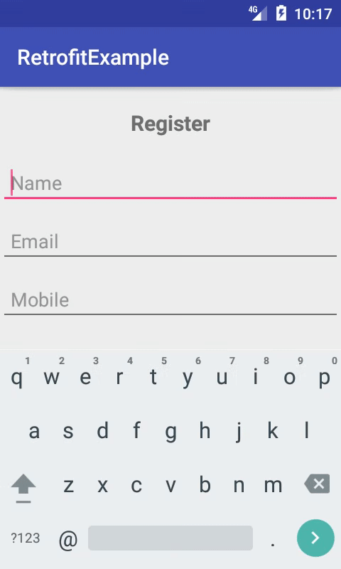
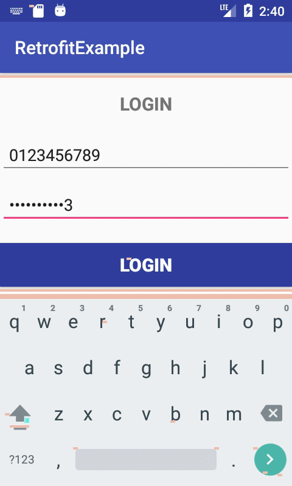

# RetrofitExample

This is an android application to show how retrofit is working

## Getting Started

These instructions will get you a copy of the project up and running on your local machine for development and testing purposes. See deployment for notes on how to deploy the project on a live system.

### Prerequisites

What things you need to install the software and how to install them

```
1. Install xampp
```

### Installing

//A step by step series of examples that tell you how to get a development env running

Say what the step will be

```
1. goto xampp->htdoc->create a Folder
2. Copy files from src->main->php
3. Paste in your folder
4.start xampp controlpannel
5. start tomcat,mysql & apache


```


```

```
## ScreenShots



